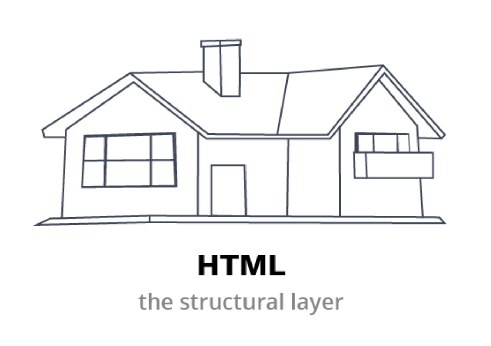
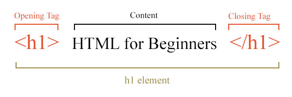
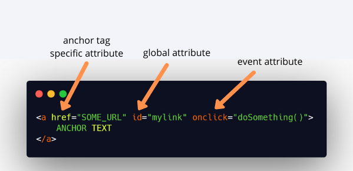
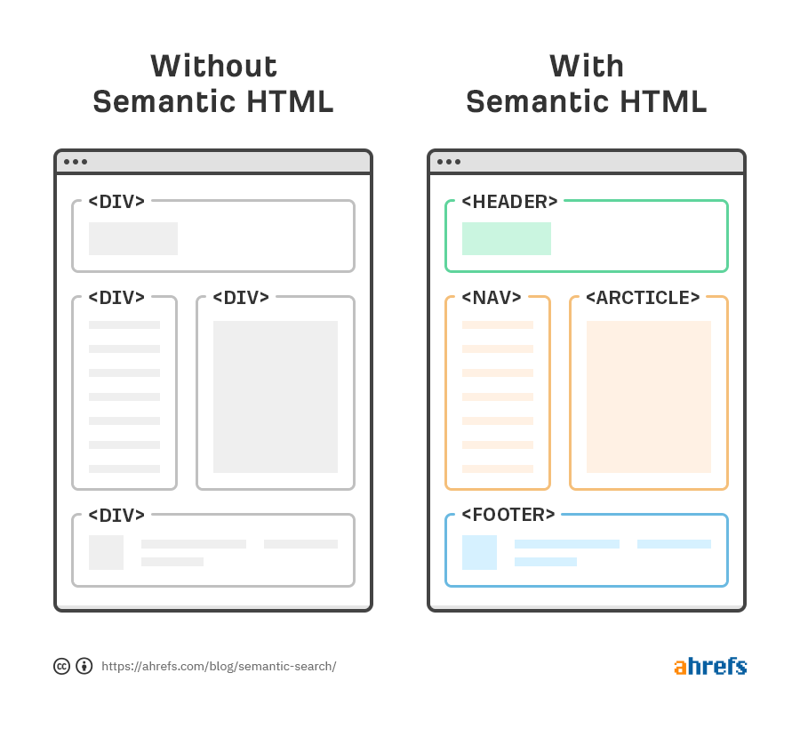

### HTML Basics (HyperText Markup Language)

HTML is the backbone of every web page. It defines the structure and content of your website.



- **Elements:** The building blocks of HTML. They define the different types of content on your page (e.g., headings `<h1>`, paragraphs `<p>`, images ``, links `<a>`, lists `<ul>` or `<ol>`, forms `<form>`).
    

- **Attributes:** Provide additional information about elements. They are added within the opening tag of an element (e.g., `href` for links, `src` for images, `class` or `id` for identifying elements).
    

- **Forms:** Enable user input through text fields, checkboxes, radio buttons, and more. Form data is usually sent to a back-end server for processing.
    

- **Semantic HTML:** Uses elements to describe the meaning of content (e.g., `<header>`, `<nav>`, `<main>`, `<article>`, `<footer>`). This improves accessibility and makes your code easier to understand.
    


### Example HTML CODE

```html
<!DOCTYPE html>
<html lang="en">
<head>
    <meta charset="UTF-8">
    <meta name="viewport" content="width=device-width, initial-scale=1.0">
    <title>HTML Basics</title>
</head>
<body>

<header>
    <h1>HTML Basics (HyperText Markup Language)</h1>
</header>

<nav>
    <a href="#elements">Elements</a>
    <a href="#attributes">Attributes</a>
    <a href="#forms">Forms</a>
    <a href="#semantic">Semantic HTML</a>
</nav>

<div class="container">
    <section id="elements" class="content">
        <h2>Elements</h2>
        <p>Elements are the building blocks of HTML. They define the different types of content on your page.</p>
        <ul>
            <li>Headings: <code>&lt;h1&gt;</code></li>
            <li>Paragraphs: <code>&lt;p&gt;</code></li>
            <li>Images: <code>&lt;img&gt;</code></li>
            <li>Links: <code>&lt;a&gt;</code></li>
            <li>Lists: <code>&lt;ul&gt;</code> or <code>&lt;ol&gt;</code></li>
            <li>Forms: <code>&lt;form&gt;</code></li>
        </ul>
    </section>

    <section id="attributes" class="content">
        <h2>Attributes</h2>
        <p>Attributes provide additional information about elements. They are added within the opening tag of an element.</p>
        <ul>
            <li><code>href</code> for links</li>
            <li><code>src</code> for images</li>
            <li><code>class</code> or <code>id</code> for identifying elements</li>
        </ul>
    </section>

    <section id="forms" class="content">
        <h2>Forms</h2>
        <p>Forms enable user input through text fields, checkboxes, radio buttons, and more. Form data is usually sent to a back-end server for processing.</p>
        <form action="#" method="post">
            <label for="name">Name:</label>
            <input type="text" id="name" name="name" required>
            
            <label for="email">Email:</label>
            <input type="email" id="email" name="email" required>
            
            <label for="age">Age:</label>
            <input type="number" id="age" name="age">
            
            <label for="gender">Gender:</label>
            <select id="gender" name="gender">
                <option value="male">Male</option>
                <option value="female">Female</option>
                <option value="other">Other</option>
            </select>
            
            <label for="message">Message:</label>
            <textarea id="message" name="message" rows="4"></textarea>
            
            <label for="subscribe">Subscribe to newsletter:</label>
            <input type="checkbox" id="subscribe" name="subscribe">
            
            <button type="submit">Submit</button>
        </form>
    </section>

    <section id="semantic" class="content">
        <h2>Semantic HTML</h2>
        <p>Semantic HTML uses elements to describe the meaning of content. This improves accessibility and makes your code easier to understand.</p>
        <ul>
            <li><code>&lt;header&gt;</code></li>
            <li><code>&lt;nav&gt;</code></li>
            <li><code>&lt;main&gt;</code></li>
            <li><code>&lt;article&gt;</code></li>
            <li><code>&lt;footer&gt;</code></li>
        </ul>
    </section>

    <section class="content">
        <h2>Box Model Example</h2>
        <div class="box-model-example">
            <p>This is an example of the box model. It includes content, padding, border, and margin.</p>
        </div>
    </section>

    <section class="content">
        <h2>Flexbox Example</h2>
        <div class="flex-container">
            <div class="flex-item">Item 1</div>
            <div class="flex-item">Item 2</div>
            <div class="flex-item">Item 3</div>
        </div>
    </section>

    <section class="content">
        <h2>Grid Example</h2>
        <div class="grid-container">
            <div class="grid-item">Item 1</div>
            <div class="grid-item">Item 2</div>
            <div class="grid-item">Item 3</div>
            <div class="grid-item">Item 4</div>
            <div class="grid-item">Item 5</div>
            <div class="grid-item">Item 6</div>
        </div>
    </section>
</div>

<footer>
    <p>&copy; 2024 Web Development Basics</p>
</footer>

</body>
</html>

```

[Goto Next 1.2-CSS.md](./1.2-CSS.md)