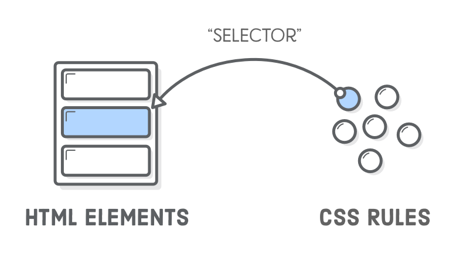

### CSS Basics (Cascading Style Sheets)

CSS is used to style your HTML elements, controlling the visual appearance of your website.


- **Selectors:** Allow you to target specific HTML elements and apply styles to them. 
  
  You can select elements by 
  
  - tag name (`h2`), 
  - class (`.main`), 
  - ID (`#content`), 
  - or combinations.

- **Box Model:** Every HTML element is a rectangular box with 
  - content,
  - padding,
  - border, and
  - margin. 
  
  Understanding this model is key to layout design.
  


- **Flexbox:** A layout tool for arranging elements in a flexible, one-dimensional way (either in rows or columns). It makes creating complex layouts much easier.

  

- **Grid:** A two-dimensional layout tool for creating more complex grid-based designs.


## CSS Example
```css
/* Selectors */
body {
    font-family: Arial, sans-serif;
    line-height: 1.6;
    margin: 0;
    padding: 0;
    background-color: #f4f4f4;
}
.container {
    width: 80%;
    margin: auto;
    overflow: hidden;
}
header, footer {
    background: #333;
    color: #fff;
    padding: 1rem 0;
    text-align: center;
}
nav {
    background: #555;
    color: #fff;
    padding: 1rem;
    text-align: center;
}
nav a {
    color: #fff;
    margin: 0 15px;
    text-decoration: none;
}
.content {
    background: #fff;
    padding: 2rem;
    margin-top: 10px;
}
ul {
    list-style-type: disc;
    padding-left: 20px;
}
form {
    background: #eee;
    padding: 1rem;
    margin-top: 1rem;
    border-radius: 5px;
}
label {
    display: block;
    margin-top: 10px;
}
input, select, textarea {
    width: 100%;
    padding: 8px;
    margin-top: 5px;
    box-sizing: border-box; /* Box Model */
}

/* Box Model */
.box-model-example {
    border: 2px solid #000;
    padding: 10px;
    margin: 20px 0;
    background: #fafafa;
}

/* Flexbox */
.flex-container {
    display: flex;
    justify-content: space-around;
    align-items: center;
    background: #ddd;
    padding: 10px;
}
.flex-item {
    background: #444;
    color: #fff;
    padding: 20px;
    margin: 10px;
    text-align: center;
    flex: 1;
}

/* Grid */
.grid-container {
    display: grid;
    grid-template-columns: repeat(3, 1fr);
    gap: 10px;
    background: #ddd;
    padding: 10px;
}
.grid-item {
    background: #444;
    color: #fff;
    padding: 20px;
    text-align: center;
}
```

Sure! Here's a brief explanation on how to apply or include CSS in HTML:

### Applying or Including CSS in HTML


#### 1. Inline CSS
Apply styles directly to HTML elements using the `style` attribute.

```html
<p style="color: blue; font-size: 14px;">This is an inline styled paragraph.</p>
```

#### 2. Internal CSS
Define styles within a `<style>` tag inside the `<head>` section of your HTML document.

```html
<head>
    <style>
        p {
            color: blue;
            font-size: 14px;
        }
    </style>
</head>
<body>
    <p>This is an internally styled paragraph.</p>
</body>
```

#### 3. External CSS
Link to an external CSS file using the `<link>` tag in the `<head>` section.

**HTML File:**
```html
<head>
    <link rel="stylesheet" href="styles.css">
</head>
<body>
    <p>This is an externally styled paragraph.</p>
</body>
```

**CSS File (styles.css):**
```css
p {
    color: blue;
    font-size: 14px;
}
```

### Tips
- Use **inline CSS** for specific, one-off styles.
- Use **internal CSS** for single-page styles.
- Use **external CSS** for reusable styles across multiple pages.

These methods help you style your HTML effectively and maintain a clean, organized codebase.


[Goto Next 1.3-Responsive-Design-and-Media-Queries.md](./1.3-Responsive-Design-and-Media-Queries.md)
