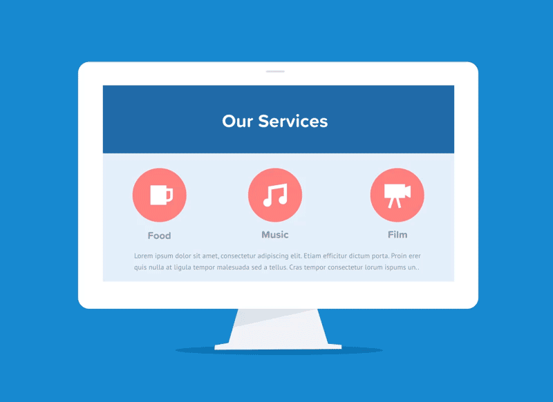
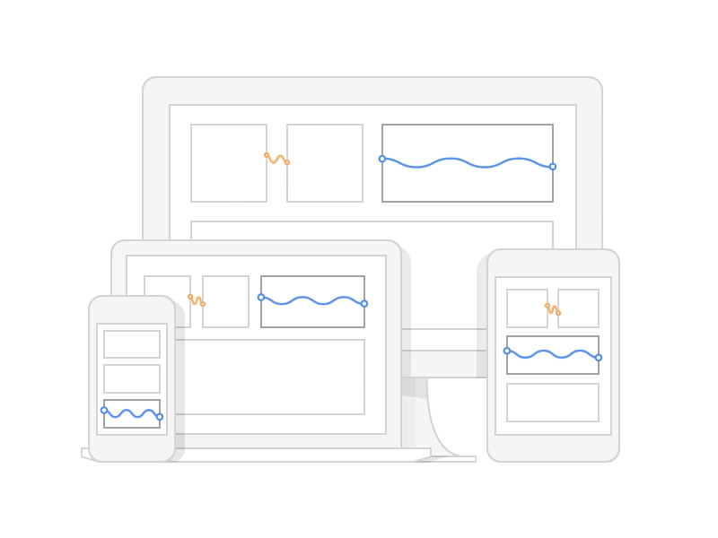

### Responsive Design

> Responsive design is an approach to web development that aims to create websites that adapt seamlessly to different screen sizes and devices. 

This means your website should look and function well on desktops, tablets, and mobile phones, providing an optimal user experience regardless of the device used.



#### Key Principles of Responsive Design:

1. **Fluid Grids:**
   
   - **Instead of fixed pixel widths:** Use percentages `%` or relative units like `em` or `rem`. 
   - **Benefits:** Elements resize proportionally to the screen width, allowing your layout to flow naturally on different devices.

   ```css
   .container {
       width: 90%; /* Takes up 90% of the parent container's width */
       max-width: 1200px; /* Sets a maximum width for larger screens */
   }
   ```

2. **Flexible Images:**
   - **Avoid fixed pixel widths:** Use `max-width: 100%;` to ensure images never exceed their container's width. 
   - **Benefits:** Prevents images from overflowing or breaking the layout on smaller screens.

   ```css
   img {
       max-width: 100%;
       height: auto; /* Maintains aspect ratio while scaling */
   }
   ```

3. **Media Queries:**
   - **Targeted Styling:** Apply different CSS styles based on specific conditions, like screen width, height, orientation, or resolution.
   - **Benefits:** Customize the layout, font sizes, and content presentation for different devices, enhancing user experience.

### Media Queries in Detail


Media queries are CSS rules enclosed in `@media` blocks. They contain a **media type** (e.g., `screen`, `print`) and a **media feature** (e.g., `max-width`, `min-width`) followed by a set of CSS rules to apply when the conditions are met.

#### Common Media Features:

- **`max-width`:** Applies styles when the screen width is equal to or less than the specified value.
- **`min-width`:** Applies styles when the screen width is equal to or greater than the specified value.
- **`orientation`:** Applies styles based on screen orientation (`landscape` or `portrait`).

#### Example:

```css
/* Styles for screens smaller than 768px */
@media (max-width: 768px) {
  body {
    font-size: 14px;
  }

  nav ul {
    display: block; /* Change navigation to a vertical list */
  }
}

/* Styles for screens wider than 1200px */
@media (min-width: 1200px) {
  .container {
    width: 1140px; /* Adjust width for larger screens */
  }
}
```

#### Breakpoints:

- **Strategic Widths:** Predefined screen widths where your layout undergoes significant changes.
- **Common Breakpoints:** 320px (small phones), 480px (portrait tablets), 768px (landscape tablets), 992px (small laptops), 1200px (desktops).
- **Customization:** Tailor your breakpoints to your specific design needs.

By combining fluid grids, flexible images, and media queries, you can create responsive websites that deliver an optimal experience across a wide range of devices and screen sizes.


[Goto Next 1.4-HTML-interview-questions.md](./1.4-HTML-interview-questions.md)