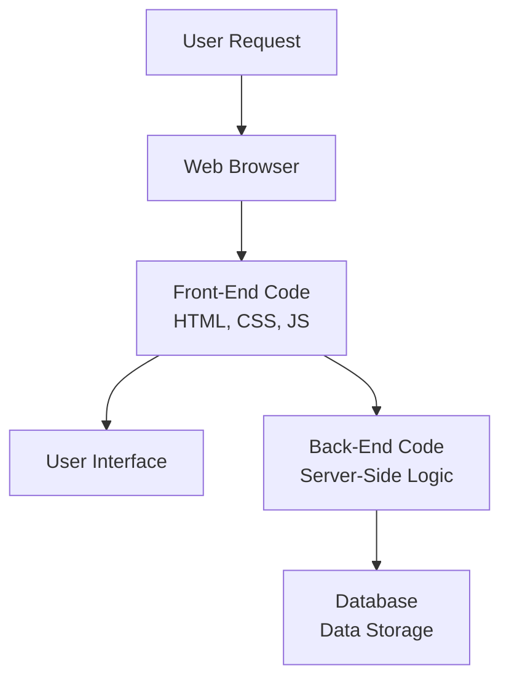

## Introduction to Web Development: Shaping the Digital World 🌐

1. **What is Web Development?** 

   - **Definition:** The process of building and maintaining websites and web applications.
   - **Analogy:** 🏗️ Constructing a digital storefront or interactive space.
   - **Two Sides:** 
      - **Front-End** (what users see and interact with) 🎨
      - **Back-End** (behind-the-scenes logic and data) ⚙️

2. **Why Web Development is Important:**

   - **Reach:** Billions of users worldwide 🌎
   - **Business:** Online presence, marketing, e-commerce 📈
   - **Communication:** Blogs, social media, forums 🗣️
   - **Education:** Online courses, resources 📚
   - **Entertainment:** Streaming, gaming 🎮

3. **The Building Blocks of the Web:**

   - **HTML (HyperText Markup Language):**  
      - The structure of web pages (headings, paragraphs, images) 🧱
   - **CSS (Cascading Style Sheets):**
      - The look and design (colors, fonts, layouts) 🎨
   - **JavaScript:**
      - Makes websites interactive (animations, dynamic content) ✨

4. **Front-End Development: Crafting the User Experience**

   - **Goal:** Create visually appealing, user-friendly interfaces 😊
   - **Tools:** HTML, CSS, JavaScript libraries/frameworks (e.g., React, Angular, Vue) 🧰
   - **Skills:** Design principles, responsiveness (adapting to devices), accessibility 📱

5. **Back-End Development: The Engine Room**

   - **Goal:** Handle data, logic, server-side operations 🧠
   - **Languages:** Python, Ruby, PHP, Java, JavaScript (Node.js) 🐍
   - **Databases:** MySQL, PostgreSQL, MongoDB 🗃️
   - **Skills:** Problem-solving, algorithms, security 🔒

6. **The Modern Web Development Landscape**

   - **Cloud Hosting:** AWS, Azure, Google Cloud ☁️
   - **Mobile-First:** Designing for mobile devices first 📱
   - **APIs (Application Programming Interfaces):** Connect different software systems 🔌

7. **Career Opportunities in Web Development:**

   - **Front-End Developer** 🎨
   - **Back-End Developer** ⚙️
   - **Full-Stack Developer** 🎨⚙️
   - **Web Designer** 🖌️
   - **Freelance** 💼

## Web Development Flow Diagram 

### How it works:

- **User Request**: The user initiates a request in their web browser (e.g., typing in a URL, clicking a link).
Web Browser: The browser sends the request to the appropriate web server.
- **Front-End Code**: The server sends the relevant HTML, CSS, and JavaScript code to the browser.
- **User Interface**: The browser interprets this code and renders the visual layout, content, and interactive elements for the user.
- **Back-End Code**: If the user interacts with dynamic elements (e.g., submitting a form), the browser sends requests to the back-end code.
- **Database**: The back-end code processes the request, interacts with the database to fetch or store data, and performs necessary logic.
- **Response**: The back-end sends a response back to the front-end (new content, updated data).
- **Update**: The browser updates the user interface based on the response from the back-end.

## Conclusion

Web development is a dynamic and exciting field! It offers opportunities to create, connect, and shape the digital world.  Whether you're a beginner or a seasoned pro, there's always more to learn and discover. 

